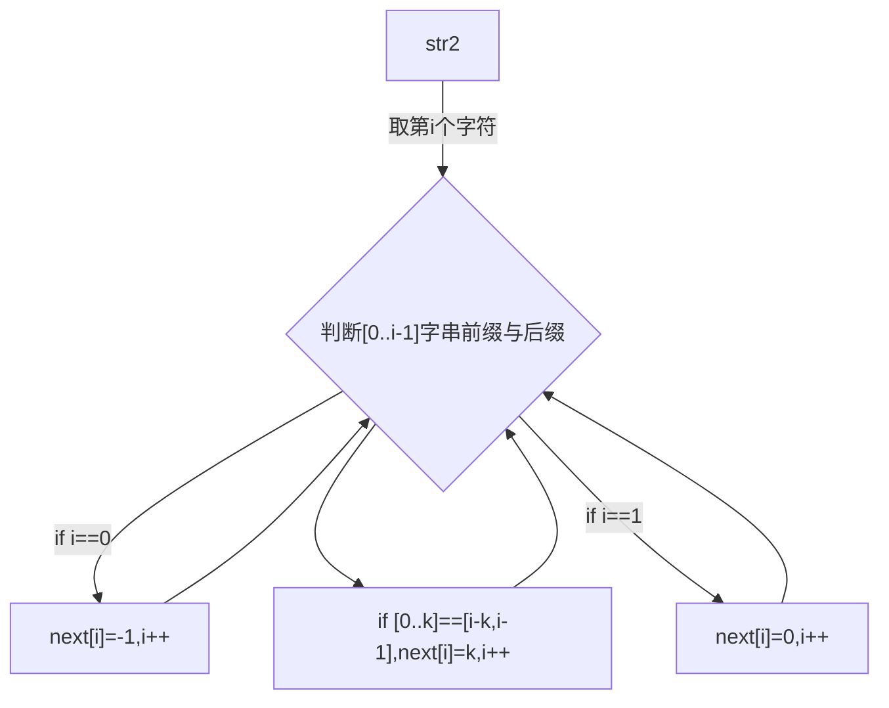
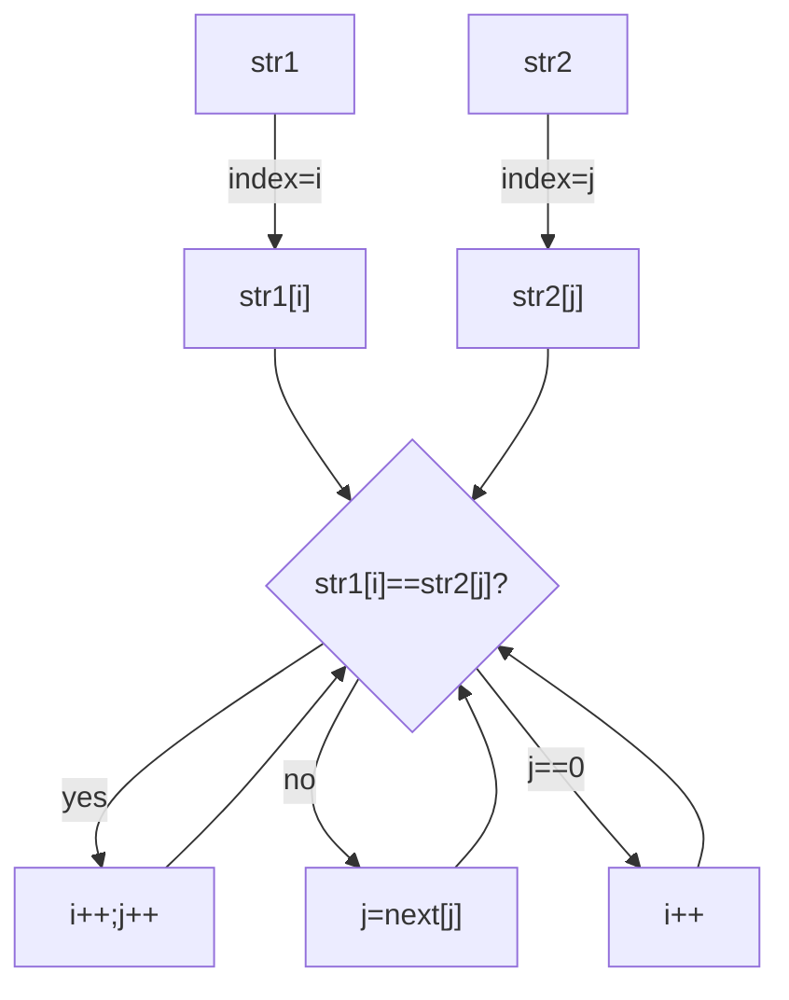

KMP算法

# 前缀与后缀的最大匹配长度
- 第i位之前的字符串，前缀与后缀的最大匹配长度。与第i位本身的内容无关
- 计算next数组

```mermaid
graph TD
    %% 计算next数组
    str2 -- 取第i个字符 --> calNext{"判断[0..i-1]字串前缀与后缀"}
    calNext -- "if i==0" --> pos0["next[i]=-1,i++"]
    pos0 --> calNext
    calNext --> posi["if [0..k]==[i-k,i-1],next[i]=k,i++"]
    posi --> calNext
    calNext -- "if i==1" --> pos1["next[i]=0,i++"]
    pos1 --> calNext
```
- next数组辅助的匹配过程

```mermaid
graph TD
    str1 -- index=i --> str1i["str1[i]"]
    str2 -- index=j --> str2j["str2[j]"]
    str1i --> compare{"str1[i]==str2[j]?"}
    str2j --> compare
    compare -- yes --> yes["i++;j++"]
    compare -- no --> no["j=next[j]"]
    compare -- "j==0" --> noequal["i++"]
    yes --> compare
    no --> compare
    noequal --> compare
```
