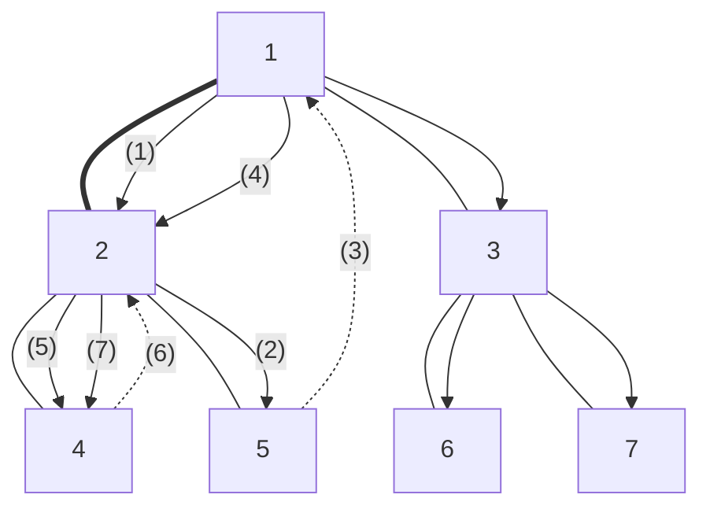
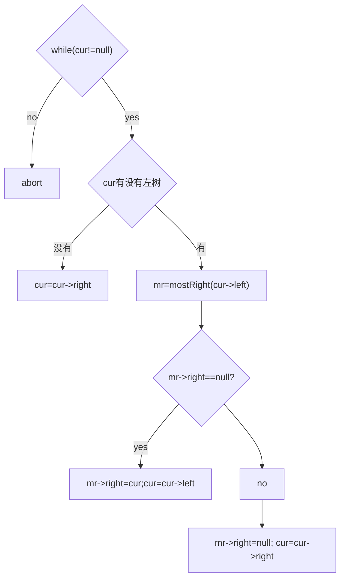

# 树的morries遍历

- 遍历过程示意

```mermaid
flowchart TD
1 === 2
1 --- 3
2 --- 4
2 --- 5
3 --- 6
3 --- 7
1 -- "(1)" --> 2
1 --> 3
2 --"(2)"--> 5
5-. "(3)" .->1
3 --> 6 & 7
1 --"(4)"--> 2
2 -- "(5)" --> 4
4 -. "(6)" .-> 2
2 --"(7)"--> 4


```

- 遍历顺序
  - 1 --> 2 --> 4 --> 2 --> 5 --> 1 --> 3 --> 6 --> 3 --> 7

```mermaid
graph TD
    cur{"while(cur!=null)"} -- no --> abort
    cur -- yes --> decision1{"cur有没有左树"}
    decision1 -- 没有 --> moveRight["cur=cur->right"]
    decision1 -- 有 --> mostRight["mr=mostRight(cur->left)"]
    mostRight --> decision2{"mr->right==null?"}
    decision2 -- yes --> mrForward["mr->right=cur;cur=cur->left"]
    %% 说明这个地方的mostRight已经来过了
    decision2 --> no --> mrBack["mr->right=null; cur=cur->right"]
    
```